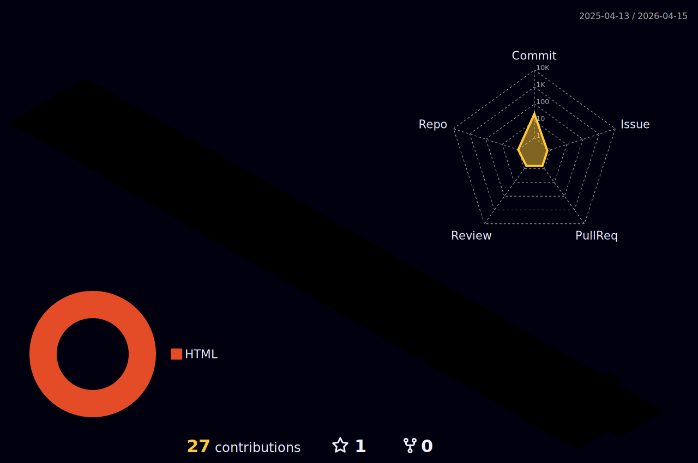

 
 

 <h2>Hello Devs, bem-vindos ao meu perfil 😄</h2> 
 <h3 align="center" >
   Tecnologias e Ferramentas: 
  </h3>
 

    

 

  
  

 

  

 

 <h1 align="left" >
     

            Rafaela Mendes
      
      
         
    

 </h1>
  
Tenho 19 anos, estudante da Faculdade Cotemig e fazendo cursos no Alura. Atualmente trabalho em uma empresa de e-commerce, chamada Wave, como Desenvolvedora Web Design.  Eu realmente gosto de estilizar as páginas web, os famosos layouts, transformando-os de "sem graça" para "com vida" e fáceis de usar. Sempre busco aprender coisas novas, quanto mais melhor.

 

  

##
 

<table border="0" align="center" width="auto" >
<tr border="0" >
<td width="60%" align="center" style="padding: 15px 15px;">
  
  
    
  

  
</td>

<td width="40%" align="center" style="padding: 15px 15px;">

  
  
  </td>
</tr>
</table>

 

##
 

          

